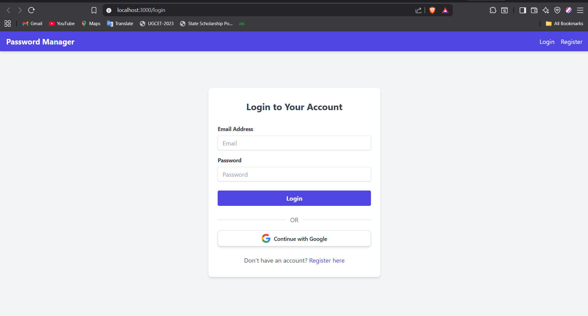

# PassGuard Application

A full-stack PassGuard application built with React, Node.js, Express, and MySQL. This application allows users to securely store and manage their passwords with features like authentication, password encryption, and a user-friendly interface.

## Features

- **Authentication**:
  - Local authentication (email + password with bcrypt for hashing)
  - JWT-based session management

- **Password Management**:
  - Add, update, delete, and view saved passwords
  - Each password entry includes: title, username/email, password, notes, and creation date
  - Passwords are encrypted before saving to the database

- **User Interface**:
  - Clean, responsive design using TailwindCSS
  - Dashboard to view all saved passwords
  - Search functionality to find specific passwords
  - Password visibility toggle and copy to clipboard features
  - Password generator tool

## Screenshots

<!-- Add screenshots of the login page, dashboard, and password management features below -->




## Tech Stack

### Frontend
- React (functional components, hooks)
- React Router for navigation
- Axios for API calls
- TailwindCSS for styling

### Backend
- Node.js with Express
- Passport.js for authentication
- JWT for session management
- bcrypt for password hashing
- crypto-js for password encryption

### Database
- MySQL with Sequelize ORM

## Project Structure

```
├── client/                 # React frontend
│   ├── public/             # Public assets
│   └── src/                # Source files
│       ├── components/     # Reusable components
│       ├── contexts/       # React contexts
│       ├── pages/          # Page components
│       └── services/       # API services
└── server/                 # Node.js backend
    ├── config/             # Configuration files
    ├── models/             # Sequelize models
    └── routes/             # API routes
```

## Setup Instructions

### Prerequisites
- Node.js and npm
- MySQL server

### Database Setup
1. Create a MySQL database named `password_manager`
2. Update the database configuration in `server/.env` file

### Backend Setup
1. Navigate to the server directory: `cd server`
2. Install dependencies: `npm install`
3. Set up environment variables by creating a `.env` file based on the provided example
4. Start the server: `npm run dev`

### Frontend Setup
1. Navigate to the client directory: `cd client`
2. Install dependencies: `npm install`
3. Start the React app: `npm start`

## API Endpoints

### Authentication
- `POST /api/auth/register` - Register a new user
- `POST /api/auth/login` - Login with email/password
- `GET /api/auth/profile` - Get current user profile (JWT required)

### Password Management
- `GET /api/passwords` - Get all passwords for the authenticated user
- `GET /api/passwords/:id` - Get a specific password by ID
- `POST /api/passwords` - Create a new password entry
- `PUT /api/passwords/:id` - Update a password entry
- `DELETE /api/passwords/:id` - Delete a password entry

## Security Features

- User passwords are hashed using bcrypt before storing in the database
- Saved site passwords are encrypted using AES (crypto-js) before storing
- JWT authentication for API access
- Environment variables for sensitive information
- CORS protection

## Future Enhancements

- Password strength meter
- Two-factor authentication
- Password expiration notifications
- Browser extension for auto-fill
- Import/export functionality